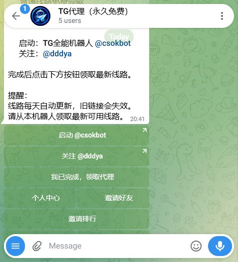
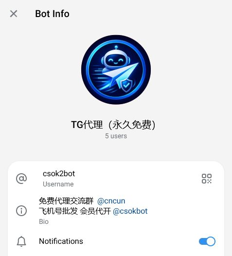
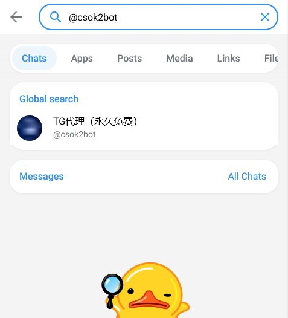

# Telegram代理机器人｜TG代理节点获取与使用工具

🌐 **在线专题教程：** [Telegram代理机器人在线专题](https://kaka813.github.io/tg-telegram-jiqiren-guide/tg-jiqiren/telegram-proxy-jiqiren/)

**Telegram 代理机器人 @csok2bot** 提供代理连接入口的查询、领取提示和基础使用说明。当前公开界面显示：用户启动机器人后，先阅读指定频道说明，再按按钮领取当日可用线路；线路信息可能更新或失效，应以机器人实时页面为准。

本页面只介绍真实可见的产品流程，不宣传“绕过封锁”“无限使用”等效果，也不保证任何线路永久免费、永久在线或适用于所有地区。

> 本仓库用于产品介绍、使用教程和版本更新，不包含机器人服务端源代码，不上传节点凭据、Token、API Key、Session、数据库或服务器配置。

## 主要功能

### 代理入口查询

用户可以从机器人首页查看当前领取步骤与相关通知入口。公开页面会提示先完成指定阅读步骤，再进入线路领取操作。

### 当日线路领取提示

机器人说明显示线路会按日更新，旧线路可能失效。为了保护凭据，本仓库不会展示、复制或保存实际服务器地址、端口、密钥与连接链接。

### 使用说明与状态提醒

页面提供必要的操作提示，帮助用户确认下一步应该在 Telegram 内完成。线路是否可用、速度和兼容性受网络环境、设备、地区和当前服务状态影响。

### 官方账号核对

通过机器人资料页与 Telegram 搜索结果可以核对用户名 @csok2bot。不要仅凭相似头像或展示名称判断账号，也不要向陌生账号发送验证码或个人信息。

## 适合哪些用户

- 对 Telegram 代理连接方式有合法需求的用户；
- 需要查看当前线路领取步骤的普通 Telegram 用户；
- 希望了解节点更新与失效规则的用户；
- 能够自行判断当地法律、组织政策与网络安全要求的人。

如果你不了解代理配置或所在地区不允许相关用途，应先咨询合格的技术人员或法律专业人士。企业、学校和公共网络还可能有额外使用规定。

## 使用方法

1. 打开 [@csok2bot](https://t.me/csok2bot)，点击“开始”；
2. 核对用户名，阅读首页的最新通知与前置要求；
3. 按页面提示查看指定频道信息；
4. 返回机器人后使用线路领取入口；
5. 只在自己的 Telegram 客户端内处理连接信息，不要把地址、端口、密钥或完整链接粘贴到 GitHub Issue；
6. 连接前检查设备与当地规则，使用后留意机器人更新；
7. 如果线路失效，等待官方页面更新，不要在公开评论中索要或交换私人凭据。

本次文档制作没有点击领取具体线路，也没有记录或公开任何节点信息。

## 使用截图

### 1. 启动与领取提示

启动页展示关注说明、线路领取入口和每日更新提示；截图不包含实际代理凭据。

### 2. 机器人资料页

资料页用于核对当前机器人的公开用户名和简介。

### 3. Telegram搜索核验

通过 Telegram 搜索核对 @csok2bot，避免误入用户名相近的账号。

## 常见问题

### 仓库会公开代理地址和密钥吗？

不会。仓库只放产品说明与经过检查的界面截图，不保存节点地址、端口、密钥、二维码或完整连接链接。

### 线路是否长期有效？

无法保证。机器人公开提示表明线路会更新，旧线路可能失效，实际状态以 @csok2bot 的当前页面为准。

### 是否保证免费、快速或不限流量？

不保证。本仓库不采用夸张承诺。可用性、费用政策、速度和限制都可能变化，请在使用前阅读机器人的最新说明。

### 为什么搜索结果里有相似账号？

Telegram 的展示名称可以重复，判断时必须核对完整用户名。本仓库对应的入口是 @csok2bot。

### 可以用于违反当地规定的活动吗？

不可以。用户必须遵守适用法律、Telegram 规则及所在组织的网络政策。仓库不提供规避监管或从事违法活动的指导。

### 为什么没有源代码？

这是产品文档仓库，不是开源项目。服务端源码和配置不公开，也不会通过 Issue 提供。

## 相关入口

- 打开机器人：[@csok2bot](https://t.me/csok2bot)
- TG机器人总导航：[Telegram机器人推荐与工具大全](https://github.com/kaka813/tg-telegram-jiqiren-guide)
- 搜索频道和群组：[TG云搜](https://github.com/kaka813/telegram-search-bot)
- 频道互推管理：[TG互推机器人](https://github.com/kaka813/telegram-channel-promotion-bot)

## 最近更新

**2026-07-20**：创建产品说明仓库，加入真实启动页、资料页和搜索核验截图，明确节点凭据保护与合法使用要求。

## 免责声明

代理服务的线路、规则与可用性可能随时变化。本仓库不运营底层网络，不保证特定速度、持续在线、免费政策或地区可用性。用户应自行确认当地法律与网络政策，并对自己的使用行为负责。请以 @csok2bot 内的最新提示为准。
